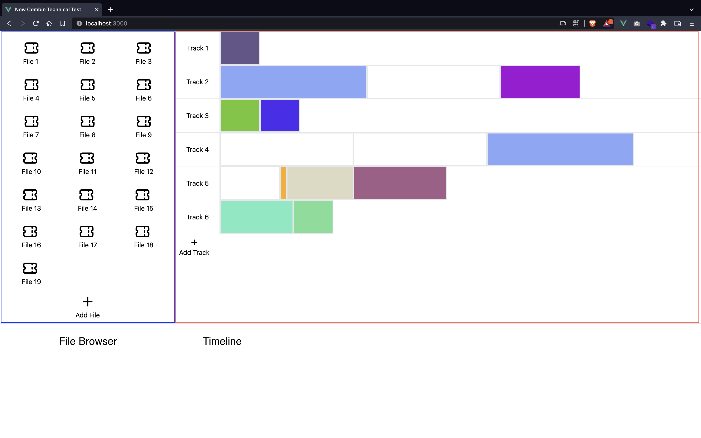

# New Combin Technical Test

## Configuración

Para poder ejecutar correctamente este proyecto se deberán de instalar las dependencias que se encuentran en el archivo __package.json__ ejecutando el comando:

```
npm install
```

Para ejecutar el proyecto en un ambiente local deberás de usar el comando:

```
npm run dev
```

## Como usar

El proyecto cuenta con una única pantalla principal separada en dos secciones principales:



### Buscador de Archivos

Esta sección nos muestra en forma de cuadricula un listado de todos los archivos que tenemos en el sitio. Esta sección implementa la funcionalidad de Drag&Drop por lo que podemos tener estos archivos en el cualquier orden.

Al presionar el botón de ___Add File___ la aplicación generada un nuevo archivo con información aleatoria, entre esta información se encuentra:

* ID: para optimizar he identificar cada elemento
* Color: el color que tendrá el documento al momento de mostrarse en el Timeline
* Size: el tamaño que ocupara el documento en el Timeline

### Timeline

En esta sección nos encontraremos un listado vertical de canales o "Tracks", estos canales se encargan de mostrar de forma horizontal los documentos que se encuentren esa fila.

Para añadir un archivo a nuestro canal deberemos de arrastrar desde el listado de archivos un elemento al canal deseado, de esta forma se representara en forma de rectángulo de un largo aleatoria y un coloro aleatorio, adicional se añade un pequeño borde de color gris para que sea mas fácil diferenciar cada elemento. Desde un canal podemos mover archivos a otro arrastrando el elemento correspondiente.
